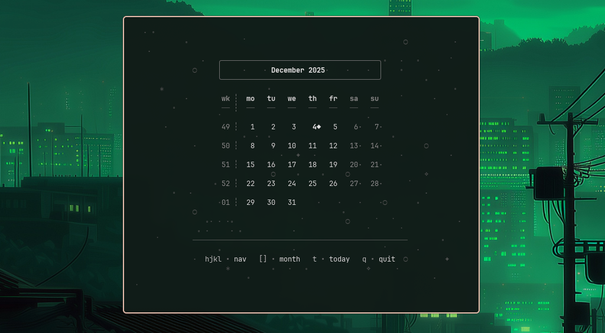

<div align="center">

```
                                    |               |
                                       | \ \   /  __|  |  /
                                      |  \ \ / \__ \    <
                                      _|   \_/  ____/ _|\_\
```

# lvsk-calendar

**Terminal-based calendar with minimalist design and extensive customization**

[](https://opensource.org/licenses/MIT)
[](https://github.com/Gianluska/lvsk-calendar)
[](https://aur.archlinux.org/packages/lvsk-calendar)



</div>

## 📖 Overview

**lvsk-calendar** is a lightweight, modular terminal calendar written in pure Bash. Designed for Arch Linux and Hyprland enthusiasts, it combines minimalist aesthetics with powerful customization options. No compilation needed—just pure shell scripting.

### Why lvsk-calendar?

- **🎨 Fully Customizable**: 5 built-in color schemes, custom backgrounds, and extensive configuration options
- **⚡ Lightning Fast**: Minimal resource usage, instant rendering, pure Bash with no dependencies beyond coreutils
- **🎯 Keyboard-Driven**: Arrow keys or vim-style navigation (hjkl)
- **🪟 Hyprland Integration**: Automatic floating window setup with zero configuration

## ✨ Features

### Visual & Interface
- **5 Built-in Color Schemes**: monochrome (default), pastel, nord, dracula, gruvbox
- **4 Background Styles**: orbital, stars, minimal, none + custom background support
- **Month View Calendar**: Full month grid with complete weeks
- **ISO 8601 Week Numbers**: Week numbers displayed alongside calendar

### Navigation
- **Arrow Keys** or **hjkl** (vim-style): Navigate between days
- **[ ]**: Previous/Next month shortcuts
- **t**: Jump to today instantly
- **q**: Exit application
- **Smart Overflow**: Navigating past month boundaries auto-switches months

### Integration
- **Hyprland**: Dynamic floating window rules (no manual config needed)
- **Waybar**: Custom module support with one-click launch
- **Terminal Emulators**: Auto-detection for ghostty, kitty, alacritty, foot, wezterm

### Customization
- **User Configuration**: `~/.config/lvsk-calendar/config` with auto-setup
- **Custom Backgrounds**: Create your own ASCII art backgrounds
- **True Color Support**: Hex (#RRGGBB) or ANSI 256-color palette
- **Character Mapping**: Customize all borders, corners, and decorative elements
- **Layout Dimensions**: Adjustable frame widths and spacing

## 📦 Installation

### From AUR (Recommended)

```bash
yay -S lvsk-calendar
```

or

```bash
paru -S lvsk-calendar
```

### Manual Build

```bash
git clone https://github.com/Gianluska/lvsk-calendar.git
cd lvsk-calendar
makepkg -si
```

### Dependencies

**Runtime:**
- `bash` - Core shell interpreter
- `coreutils` - date, tput, stty commands

## 🚀 Usage

### Launch Methods

#### Direct Launch (in current terminal)
```bash
lvsk-calendar
```
Opens the calendar in your existing terminal window.

#### Launcher (recommended for Hyprland)
```bash
lvsk-calendar-launcher
```
Opens a new floating terminal window with auto-configured settings:
- 600x500px centered window
- Instant floating (no animations)
- Auto-closes on exit
- No manual Hyprland config needed!

### Keyboard Controls

| Key(s) | Action | Details |
|--------|--------|---------|
| `↑` / `k` | Previous week | Move up 7 days |
| `↓` / `j` | Next week | Move down 7 days |
| `←` / `h` | Previous day | Move left 1 day |
| `→` / `l` | Next day | Move right 1 day |
| `[` | Previous month | Jump to previous month |
| `]` | Next month | Jump to next month |
| `t` | Jump to today | Return to current date |
| `q` | Quit | Exit application cleanly |

## ⚙️ Configuration

### First Run Setup

On first launch, lvsk-calendar automatically:
1. Creates `~/.config/lvsk-calendar/` directory
2. Copies default configuration to `~/.config/lvsk-calendar/config`
3. Copies all built-in backgrounds to `~/.config/lvsk-calendar/backgrounds/`

### Configuration File

Edit your configuration:
```bash
nvim ~/.config/lvsk-calendar/config
```

### Color Schemes

Choose from 5 built-in color schemes:

```
color_scheme=monochrome    # Warm pastel monochrome (default)
color_scheme=pastel        # Soft pastel colors
color_scheme=nord          # Nord theme colors
color_scheme=dracula       # Dracula theme
color_scheme=gruvbox       # Gruvbox theme
```

### Background Styles

Choose decorative backgrounds:

```
background_style=orbital   # Cosmic orbital design (default)
background_style=stars     # Starry night pattern
background_style=minimal   # Clean dots pattern
background_style=none      # No decoration
background_style=custom    # Your custom background
```

### Custom Backgrounds

Create your own background:

1. **Copy an existing background:**
   ```bash
   cp ~/.config/lvsk-calendar/backgrounds/orbital.sh \
      ~/.config/lvsk-calendar/backgrounds/custom.sh
   ```

2. **Edit the function:**
   ```bash
   nvim ~/.config/lvsk-calendar/backgrounds/custom.sh
   ```

3. **Activate in config:**
   ```
   background_style=custom
   ```

### Advanced Customization

#### Layout Dimensions
```
header_frame_width=40        # Month/year frame width
footer_frame_width=52        # Controls footer width
calendar_grid_width=38       # Calendar grid width
```

#### Behavior Settings
```
skip_splash=false            # Show/hide splash screen on startup
```

#### Custom Colors (hex or ANSI 256)
```
# Using hex colors
color_base=#E0E0E0
color_accent=#88C0D0

# Or ANSI 256 codes
color_base=253
color_subtle=242
color_highlight_bg=236
```

#### Custom Characters
```
char_h=─              # Horizontal border
char_v=│              # Vertical border
char_tl=╭             # Top-left corner
char_tr=╮             # Top-right corner
char_bl=╰             # Bottom-left corner
char_br=╯             # Bottom-right corner
```

## 🔧 Integration

### Hyprland

The launcher (`lvsk-calendar-launcher`) provides **zero-config** Hyprland integration:

**How it works:**
1. Dynamically adds windowrules via `hyprctl`
2. Opens terminal with special title
3. Rules apply **before** window appears
4. Auto-closes window on exit

**Window Configuration:**
- **Float:** Yes (automatic)
- **Size:** 600x500 pixels
- **Position:** Centered
- **Animations:** Instant (no transition delay)

### Waybar

Add a calendar button to your Waybar:

**`~/.config/waybar/config`**
```json
{
  "modules-center": [
    "clock",
    "custom/calendar"
  ],

  "custom/calendar": {
    "format": " 󰃭 ",
    "on-click": "lvsk-calendar-launcher",
    "tooltip-format": "Click to open calendar"
  }
}
```

## 🤝 Contributing

Contributions are welcome! Areas for improvement:
- Terminal emulator support
- Feature enhancements
- Bug fixes
- New background designs

## 📄 License

MIT - Use it however you want.

## 🙏 Acknowledgments

- Inspired by minimalist terminal UI design
- Built for the Arch Linux and Hyprland community
- Powered by pure Bash and community feedback

## 📚 Additional Resources

- **Repository:** https://github.com/Gianluska/lvsk-calendar
- **AUR Package:** https://aur.archlinux.org/packages/lvsk-calendar
- **Issues:** https://github.com/Gianluska/lvsk-calendar/issues
- **Example Configuration:** `config.example`

---

<div align="center">

**Made with ❤️ from Brazil**

[⬆ Back to top](#lvsk-calendar)

</div>
